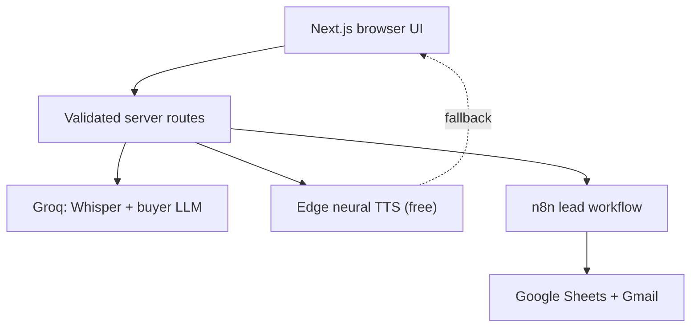

# CloseLoop

Sales practice and lead automation in one app — AI buyer roleplay with voice, plus form-to-Sheet-to-email lead profiling.

| | |
|---|---|
| **Live demo** | [https://sales-bot-sooty.vercel.app](https://sales-bot-sooty.vercel.app) |
| **Repository** | [https://github.com/pantha704/sales-bot](https://github.com/pantha704/sales-bot) |
| **Login** | None — open the URL and use either flow |
| **Keys required?** | No. Without credentials the app runs in labelled **Demo mode** |

### What you get in 30 seconds

1. Open the live demo (or run locally with `npm install && npm run dev`).
2. **Roleplay:** `/roleplay` — talk or type to an AI buyer, switch personas, hear free neural voice, download transcript, score the call.
3. **Leads:** `/lead-profiler` — submit a lead; with n8n configured it classifies → Google Sheet → Gmail; without keys it returns a labelled demo classification.

Guides: [Roleplay](docs/part-1-roleplay.md) · [Lead profiler / n8n](docs/part-2-n8n.md)

---

## Architecture



- API keys stay on the server (no secrets under `NEXT_PUBLIC_`).
- Provider failures surface as safe user messages.
- Roleplay falls back to a deterministic buyer and browser voice when keys or providers are unavailable.
- Live paths are labelled `Live AI` / `n8n live`; offline paths are labelled `Demo mode`.

---

## Stack

| Layer | Choice |
|---|---|
| App | Next.js 16, React 19, TypeScript, Tailwind CSS, shadcn/ui |
| STT | Groq Whisper |
| Buyer LLM | Groq Llama (`llama-3.3-70b-versatile` by default) |
| TTS | Edge neural voices (default, no key) → browser speech → optional Neuphonic / Groq Orpheus |
| Validation | Zod at external boundaries |
| Automation | n8n Cloud → Google Sheets + Gmail |
| Quality | Vitest, ESLint, TypeScript, production-build CI |

---

## Quick start

**Requires** Node.js 20.9+

```bash
npm install
cp .env.example .env.local
npm run dev
```

Open [http://localhost:3000](http://localhost:3000).

- `/roleplay` — sales roleplay studio  
- `/lead-profiler` — lead intake form  

No keys needed to explore either flow in Demo mode.

### Environment variables

Copy from [`.env.example`](.env.example). Server-only — never commit `.env.local`.

```dotenv
# Roleplay: buyer chat, STT, optional coach score
GROQ_API_KEY=
GROQ_CHAT_MODEL=llama-3.3-70b-versatile
GROQ_TTS_VOICE=troy

# Voice (edge = free default; no key)
TTS_PROVIDER=edge
EDGE_TTS_VOICE=en-US-AriaNeural
NEUPHONIC_API_KEY=
NEUPHONIC_VOICE_ID=
# Force browser-only client voice: NEXT_PUBLIC_CLOUD_TTS=0

# Lead automation (both required when URL is set; fail-closed)
N8N_LEAD_WEBHOOK_URL=
N8N_WEBHOOK_SECRET=

# Optional: shared rate limits on Vercel
UPSTASH_REDIS_REST_URL=
UPSTASH_REDIS_REST_TOKEN=
```

API routes are rate-limited per IP. With Upstash, limits are shared across serverless instances; without it, a process-local fallback is used.

---

## Roleplay — AI buyer studio

Speak or type as a sales rep. The AI answers as a configurable buyer. You hear the reply (free Edge neural TTS by default), can switch buyer presets, download the transcript, and score the call against a discovery rubric.

### Setup

1. Run the app (Quick start above).
2. Open `/roleplay`.
3. Optional for live AI: set `GROQ_API_KEY` in `.env.local`.
4. Voice works with **no TTS key** (`TTS_PROVIDER=edge`). Optional: Neuphonic or paid Orpheus.

### What works without keys

| Feature | Without keys | With Groq |
|---|---|---|
| Buyer replies | Deterministic in-character **Demo mode** | Live Llama buyer |
| Microphone → text | Needs Groq Whisper | Live STT |
| Buyer voice | Free Edge TTS (no key) or browser speech | Same |
| Call score (≥2 seller turns) | Deterministic rubric | Live Groq coach |

### Scoring

After at least two seller turns, use **Score this call** (clipboard icon in the studio header):

- Five weighted dimensions: discovery, objections, value, structure, next steps
- Score card under the transcript; also appended to transcript download
- Separate coach path — the buyer model never scores itself mid-call

More detail: [docs/part-1-roleplay.md](docs/part-1-roleplay.md)

---

## Lead profiler — classify, log, notify

Website form posts visitor details + page history. The API validates the payload, then either:

- **Demo mode:** classifies locally and labels the result, or  
- **n8n live:** authenticated webhook → validate → Groq classify → Google Sheet row → Gmail → JSON response.

Exported workflows live in `workflows/`.

### App setup

1. Run the app; open `/lead-profiler`.
2. Submit a lead with empty n8n env → demo classification.
3. For live automation, set both:

```dotenv
N8N_LEAD_WEBHOOK_URL=https://YOUR-N8N/webhook/lead-profiler
N8N_WEBHOOK_SECRET=long-random-secret
```

### n8n setup

1. Create a Google Sheet; import `workflows/google-sheet-template.csv` into a tab named `Leads`.
2. In n8n: **Import from File** → `workflows/lead-profiler.json` and `workflows/lead-profiler-error-handler.json`.
3. Create Header Auth for the webhook (`X-Webhook-Secret`) and for Groq (`Authorization: Bearer …`).
4. Connect Google Sheets + Gmail with least privilege.
5. Replace placeholders (`REPLACE_WITH_GOOGLE_SHEET_ID`, sales/ops emails, credentials).
6. Attach the error workflow; publish; copy production webhook URL + secret into `.env.local` / Vercel env.
7. Redeploy or restart the app; submit sample leads from `/lead-profiler`.

Do **not** hardcode the Groq key into exported JSON. Use n8n credentials only.

More detail: [docs/part-2-n8n.md](docs/part-2-n8n.md)

---

## Repository map

```text
src/app/roleplay/                 Sales roleplay interface
src/app/lead-profiler/            Lead intake interface
src/app/api/roleplay/             Conversation, STT, TTS, and score routes
src/app/api/leads/                Validated n8n gateway
src/features/roleplay/            Personas, prompting, scoring, recording
src/features/roleplay/scoring/    Rubric, mock/live coach scorers
src/features/leads/               Lead schemas and demo classifier
workflows/lead-profiler.json      Importable main n8n workflow
workflows/lead-profiler-error-handler.json
workflows/google-sheet-template.csv
docs/                             Feature guides
.env.example                      Server-only env template
```

---

## Development

```bash
npm run lint
npm run typecheck
npm test
npm run build
```

CI runs the same four checks on pushes and pull requests.

---

## Design choices

- Voice is low-latency **turn-based audio**, not full-duplex WebRTC. Barge-in / continuous streaming would be a later LiveKit/WebRTC phase.
- Self-hosted open TTS (Qwen3-TTS, NeuTTS, etc.) needs a model service and multi-GB weights — documented as a future option, not part of this serverless deploy.
- Groq Orpheus is a **paid**, opt-in TTS path (`TTS_PROVIDER=groq`). Browser speech is the final no-key fallback; quality varies by device.
- Transcripts and call scores stay in the browser session and are downloaded explicitly; no database is required.
- Post-call scoring is on-demand so the buyer stays in character; the coach runs only when requested.
- The lead workflow is sized for demo volume. Production would add lead-ID uniqueness before side effects, a durable retry queue, retention rules, and monitoring.
- Exported n8n JSON keeps the automation portable if the cloud workspace changes.
