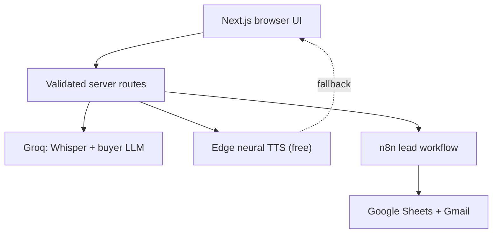

# CloseLoop

**Eubrics Automation Engineer assignment** — one GitHub repo covering Parts 1–3.

| | |
|---|---|
| **Live demo** | [https://sales-bot-sooty.vercel.app](https://sales-bot-sooty.vercel.app) |
| **Repository** | [https://github.com/pantha704/sales-bot](https://github.com/pantha704/sales-bot) |
| **Login** | None — open the URL and use either flow |
| **Keys required?** | No. Without credentials the app runs in labelled **Demo mode** |

### What you get in 30 seconds

1. Open the live demo (or run locally with `npm install && npm run dev`).
2. **Part 1 — Roleplay:** `/roleplay` — talk or type to an AI buyer, switch personas, hear free neural voice, download transcript, score the call.
3. **Part 2 — Leads:** `/lead-profiler` — submit a lead; with n8n configured it classifies → Google Sheet → Gmail; without keys it returns a labelled demo classification.
4. **Part 3 — Case study:** [docs/part-3-automation.md](docs/part-3-automation.md) — sanitized monday.com → Outlook operations automation (not a separate deployable app).

### AI tools & keys used (disclosure)

| Use | Tool / service | Key? |
|---|---|---|
| Coding engine (build this repo) | OpenAI Codex (assignment allows “Claude Code or similar”) | N/A |
| Buyer chat + STT (Whisper) + optional coach score | Groq (Llama + Whisper) | `GROQ_API_KEY` |
| Buyer voice (default) | Microsoft Edge neural TTS via `node-edge-tts` | **None** |
| Buyer voice (fallback) | Browser Web Speech API | None |
| Buyer voice (optional) | Neuphonic | `NEUPHONIC_API_KEY` |
| Buyer voice (paid opt-in only) | Groq Orpheus | same Groq key + `TTS_PROVIDER=groq` |
| Lead automation | n8n Cloud → Google Sheets + Gmail | `N8N_LEAD_WEBHOOK_URL` + `N8N_WEBHOOK_SECRET` |

Full iteration notes: [docs/ai-iteration-log.md](docs/ai-iteration-log.md).

### Per-part docs (assignment-style mini-READMEs)

| Part | One-line summary | Detail doc |
|---|---|---|
| **1** Roleplay voice bot | Configurable AI buyer, free TTS, transcript + score | [docs/part-1-roleplay.md](docs/part-1-roleplay.md) |
| **2** Lead profiler | Form → n8n → classify → Sheet → email | [docs/part-2-n8n.md](docs/part-2-n8n.md) |
| **3** Existing automation | monday.com status change → Outlook notify | [docs/part-3-automation.md](docs/part-3-automation.md) |

Demo / submission checklist: [docs/demo-checklist.md](docs/demo-checklist.md).

---

## Detailed documentation

Everything below is the full technical README: architecture, setup, env vars, repo map, tradeoffs, and verification.

---

## Architecture



- API keys never enter browser code (`NEXT_PUBLIC_` is not used for secrets).
- Provider errors become safe user messages.
- Roleplay has deterministic buyer + browser-native voice fallbacks when keys or providers fail.
- Live integrations are labelled `Live AI` / `n8n live`; local fallbacks are labelled `Demo mode`.

---

## Stack

- **App:** Next.js 16, React 19, TypeScript, Tailwind CSS, shadcn/ui
- **STT:** Groq Whisper
- **Buyer LLM:** Groq-hosted Llama (`GROQ_CHAT_MODEL`, default `llama-3.3-70b-versatile`)
- **TTS (default):** free Microsoft Edge neural voices via `node-edge-tts` — no API key
- **TTS fallbacks:** browser `speechSynthesis` → optional Neuphonic → paid Groq Orpheus only if `TTS_PROVIDER=groq`
- **Validation:** Zod at all external boundaries
- **Automation:** n8n Cloud, Google Sheets, Gmail
- **Quality gate:** Vitest, ESLint, TypeScript, production-build CI

---

## Quick start (local)

**Requirement:** Node.js 20.9 or newer.

```bash
npm install
cp .env.example .env.local
npm run dev
```

Open [http://localhost:3000](http://localhost:3000).

- `/roleplay` — Part 1
- `/lead-profiler` — Part 2

No keys are required to explore either flow in Demo mode.

### Environment variables

Copy from [`.env.example`](.env.example). Server-only — never prefix with `NEXT_PUBLIC_`, never commit `.env.local`.

```dotenv
# --- Part 1: live buyer chat, STT, optional coach score ---
GROQ_API_KEY=
GROQ_CHAT_MODEL=llama-3.3-70b-versatile
GROQ_TTS_VOICE=troy

# --- Part 1: voice (edge = free default; no key) ---
TTS_PROVIDER=edge
EDGE_TTS_VOICE=en-US-AriaNeural
NEUPHONIC_API_KEY=
NEUPHONIC_VOICE_ID=
# Force browser-only client voice: NEXT_PUBLIC_CLOUD_TTS=0

# --- Part 2: live n8n (both required when URL is set; fail-closed) ---
N8N_LEAD_WEBHOOK_URL=
N8N_WEBHOOK_SECRET=

# --- Optional: shared rate limits on Vercel ---
UPSTASH_REDIS_REST_URL=
UPSTASH_REDIS_REST_TOKEN=
```

API routes are rate-limited per IP. With Upstash, limits are shared across serverless instances; without it, a process-local fallback is used (fine for local demo).

---

## Part 1 — Sales roleplay voice bot

### Short

Speak or type as a sales rep. The AI answers as a configurable buyer. You hear the reply (free Edge neural TTS by default), can switch buyer presets, download the transcript, and score the call against a discovery rubric.

### Setup

1. Run the app (Quick start above).
2. Open `/roleplay`.
3. Optional for live AI: set `GROQ_API_KEY` in `.env.local`.
4. Voice works with **no TTS key** (`TTS_PROVIDER=edge`). Optional: Neuphonic or paid Orpheus.

### What works without keys

| Feature | Without keys | With Groq |
|---|---|---|
| Buyer replies | Deterministic in-character **Demo mode** | Live Llama buyer |
| Microphone → text | Needs Groq Whisper | Live STT |
| Buyer voice | Free Edge TTS (no key) or browser speech | Same |
| Call score (≥2 seller turns) | Deterministic rubric | Live Groq coach |

### Scoring

After at least two seller turns, use **Score this call** (clipboard icon in the studio header):

- Five weighted dimensions: discovery, objections, value, structure, next steps
- Score card under the transcript; also appended to transcript download
- Separate coach path — the buyer model never scores itself mid-call

### Deep dive

Architecture, personas, routes, prompt rules, and manual test script:  
[docs/part-1-roleplay.md](docs/part-1-roleplay.md)

---

## Part 2 — Lead-profiling workflow (n8n)

### Short

Website form posts visitor details + page history. The Next.js API validates the payload, then either:

- **Demo mode:** classifies locally and labels the result, or  
- **n8n live:** authenticated webhook → validate → Groq classify → Google Sheet row → Gmail → JSON response.

Exported workflows live in `workflows/`.

### Setup (app only)

1. Run the app; open `/lead-profiler`.
2. Submit a lead with empty n8n env → demo classification (safe for reviewers).
3. For live automation, set both:

```dotenv
N8N_LEAD_WEBHOOK_URL=https://YOUR-N8N/webhook/eubrics-lead-profiler
N8N_WEBHOOK_SECRET=long-random-secret
```

### Setup (n8n — import path)

1. Create a Google Sheet; import `workflows/google-sheet-template.csv` into a tab named `Leads`.
2. In n8n: **Import from File** → `workflows/lead-profiler.json` and `workflows/lead-profiler-error-handler.json`.
3. Create Header Auth for the webhook (`X-Webhook-Secret`) and for Groq (`Authorization: Bearer …`).
4. Connect Google Sheets + Gmail with least privilege.
5. Replace placeholders (`REPLACE_WITH_GOOGLE_SHEET_ID`, sales/ops emails, credentials).
6. Attach the error workflow; publish; copy production webhook URL + secret into `.env.local` / Vercel env.
7. Redeploy or restart the app; submit both sample categories from `/lead-profiler`.

Do **not** hardcode the Groq key into exported JSON. Use n8n credentials only.

### Deep dive

Node-by-node rebuild guide, sample payloads, test matrix, production limits:  
[docs/part-2-n8n.md](docs/part-2-n8n.md)

---

## Part 3 — Existing automation case study

### Short

Sanitized write-up of a real operations automation: **monday.com status change → validate fields → compose message → Outlook email → record notification state** to reduce duplicates.

There is no separate app to deploy for Part 3. Reviewers should read the doc; if a live recreation is unavailable, the Part 2 n8n flow is the runnable automation demonstration in this repo.

### Setup / .env

None in this repository. Part 3 is documentation only (employer data, board IDs, and credentials intentionally excluded).

### AI tools for Part 3

None required to understand the design. The case study is human-documented architecture (trigger, conditions, actions, reliability choices).

### Deep dive

[docs/part-3-automation.md](docs/part-3-automation.md)

---

## Repository map

```text
src/app/roleplay/                 Sales roleplay interface
src/app/lead-profiler/            Lead intake interface
src/app/api/roleplay/             Conversation, STT, TTS, and score routes
src/app/api/leads/                Validated n8n gateway
src/features/roleplay/            Personas, prompting, scoring, recording
src/features/roleplay/scoring/    Rubric, mock/live coach scorers
src/features/leads/               Lead schemas and demo classifier
workflows/lead-profiler.json      Importable main n8n workflow
workflows/lead-profiler-error-handler.json
workflows/google-sheet-template.csv
docs/                             Per-part guides, AI log, demo checklist
.env.example                      Server-only env template
```

---

## Verification

```bash
npm run lint
npm run typecheck
npm test
npm run build
```

CI runs the same four checks on pushes and pull requests.

---

## Deliberate tradeoffs and limits

- Voice is low-latency **turn-based audio**, not full-duplex WebRTC. That keeps one deployable TypeScript app understandable for a live interview. Barge-in / continuous streaming would be a later LiveKit/WebRTC phase.
- Open models such as Qwen3-TTS or NeuTTS need a Python/model service and multi-GB weights; they are documented as a future self-hosted option, not part of this serverless assignment build.
- Groq Orpheus is a **paid**, opt-in TTS path (`TTS_PROVIDER=groq`). Browser speech is the final no-key fallback and quality varies by device.
- Transcripts and call scores stay in the browser session and are downloaded explicitly; no database is required for this assignment.
- Post-call scoring is on-demand so the buyer stays in character; the coach model (or mock rubric) runs only when requested.
- An n8n Cloud trial is enough for the deadline; the production webhook stops when the trial/workspace stops. Exported JSON keeps the automation portable.
- The lead workflow is sized for demo volume. Production would add lead-ID uniqueness before side effects, a durable retry queue, retention rules, and monitoring.

---

## AI tooling disclosure (full)

OpenAI Codex was used as the AI coding engine to plan, implement, test, inspect failures, and revise this repository. Changes were made in small verified checkpoints. The assignment explicitly permits “Claude Code or similar engine”; **Claude Code was not used**.

Runtime AI services (with keys only when you configure them):

- **Groq** — Whisper STT, Llama buyer chat, optional call coach, optional paid Orpheus TTS
- **Edge TTS** — default free neural speech (no key)
- **Neuphonic** — optional hosted TTS
- **n8n + Groq HTTP** — lead classification inside the workflow
- **Google Sheets + Gmail** — lead storage and notification (n8n credentials)

How direction and verification were handled: [docs/ai-iteration-log.md](docs/ai-iteration-log.md).

---

## Submit to Eubrics

To: `hello@eubrics.com`  
Subject: `Campus - Automation Engineer Assignment`  
Deadline: **July 26**

Include:

- This repo: https://github.com/pantha704/sales-bot  
- Hosted app: https://sales-bot-sooty.vercel.app  
- Part 1 / 2 / 3 demo videos or Loom if you record them  
- Any credentials only if you gate the demo (this deploy does not need login)

Questions: `maxim@eubrics.com`
