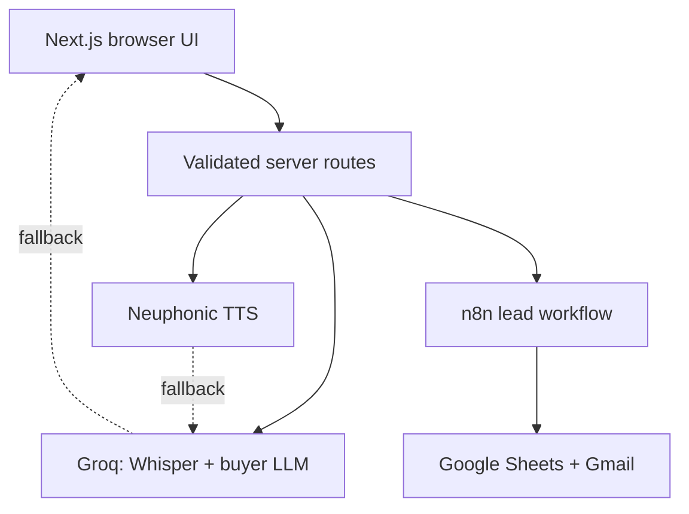

# CloseLoop

CloseLoop is a configurable voice roleplay and lead-profiling system built for
the Eubrics Automation Engineer assignment.

- **Part 1:** speak or type to a realistic AI buyer, switch buyer
  configurations, hear the response, and download the transcript.
- **Part 2:** submit visitor details and simulated page history to an n8n
  workflow that classifies, stores, and emails the lead.
- **Part 3:** a sanitized case study of an existing monday.com and Outlook
  operations automation.

The web app deliberately works without credentials. It labels deterministic
local results as `Demo mode`, while configured providers are labelled `Live AI`
or `n8n live`.

## Architecture



API keys never enter browser code. Provider errors are converted to safe user
messages, and the roleplay has deterministic and browser-native fallbacks.

## Stack

- Next.js 16, React 19, TypeScript, Tailwind CSS, and shadcn/ui
- Groq Whisper for speech-to-text
- Groq-hosted Llama for the buyer conversation
- Neuphonic TTS, with Groq Orpheus and browser speech fallbacks
- Zod validation at all external boundaries
- n8n Cloud, Google Sheets, Gmail, and the Groq API
- Vitest, ESLint, TypeScript, and a production-build CI gate

## Quick start

Node.js 20.9 or newer is required.

```bash
npm install
cp .env.example .env.local
npm run dev
```

Open [http://localhost:3000](http://localhost:3000).

No keys are required to explore both flows. Add server-only credentials to
`.env.local` to enable live integrations:

```dotenv
GROQ_API_KEY=
GROQ_CHAT_MODEL=llama-3.3-70b-versatile
GROQ_TTS_VOICE=troy

NEUPHONIC_API_KEY=
NEUPHONIC_VOICE_ID=
TTS_PROVIDER=neuphonic

N8N_LEAD_WEBHOOK_URL=
N8N_WEBHOOK_SECRET=
```

Never prefix these values with `NEXT_PUBLIC_` and never commit `.env.local`.

## Repository map

```text
src/app/roleplay/                 Sales roleplay interface
src/app/lead-profiler/            Lead intake interface
src/app/api/roleplay/             Conversation, STT, and TTS routes
src/app/api/leads/                Validated n8n gateway
src/features/roleplay/            Personas, prompting, fallbacks, recording
src/features/leads/               Lead schemas and demo classifier
workflows/lead-profiler.json      Importable main n8n workflow
workflows/lead-profiler-error-handler.json
workflows/google-sheet-template.csv
docs/                             Setup, decisions, interview, and demo notes
```

## Assignment setup

- [Part 1: roleplay architecture and TTS decision](docs/part-1-roleplay.md)
- [Part 2: n8n import and manual rebuild guide](docs/part-2-n8n.md)
- [Part 3: existing automation case study](docs/part-3-automation.md)
- [AI direction and iteration log](docs/ai-iteration-log.md)
- [Demo and submission checklist](docs/demo-checklist.md)

## Verification

```bash
npm run lint
npm run typecheck
npm test
npm run build
```

CI runs the same four checks on pushes and pull requests.

## Deliberate tradeoffs and limits

- Voice is low-latency **turn-based audio**, not full-duplex WebRTC. This keeps
  one deployable TypeScript application understandable for the live interview.
  Barge-in and continuous streaming would be the next LiveKit/WebRTC phase.
- Qwen3-TTS and NeuTTS are open models, but running them means operating a
  Python/model service with several gigabytes of weights and predictable
  compute. They are documented as a future self-hosted option rather than added
  to a serverless assignment build.
- Groq Orpheus is a secondary TTS provider and the adapter conservatively limits
  input to 200 characters. Browser `speechSynthesis` is the final no-key
  fallback and sounds different across devices.
- Transcripts remain in the browser session and are downloaded explicitly; no
  database is needed for this assignment.
- An n8n Cloud trial is sufficient for the deadline, but its production webhook
  stops when the trial/workspace stops. The exported workflows keep the
  automation portable.
- The current workflow is designed for a demo-sized lead volume. A production
  version should add a unique constraint or lead-ID lookup before side effects,
  a durable retry queue, retention rules, and monitoring.

## AI tooling disclosure

OpenAI Codex was used as the AI coding engine to plan, implement, test, inspect
failures, and revise this repository. Changes were made in small verified
checkpoints. The assignment explicitly permits “Claude Code or similar engine”;
no claim is made that Claude Code was used.
