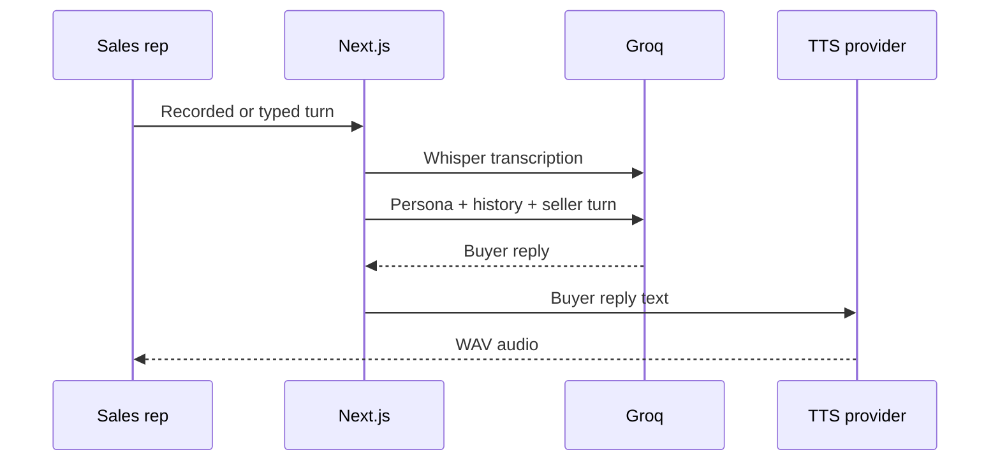

# Part 1 — Sales Roleplay Voice Bot

## What the user can do

1. Choose one of three buyer configurations.
2. Speak through the microphone or type a seller turn.
3. Receive an in-character buyer response.
4. Hear that response through the configured TTS provider.
5. Switch difficulty/persona, reset the call, mute speech, or download the
   transcript.

The three presets intentionally exercise different industries, personalities,
goals, objections, difficulty behavior, and speaking rates. They use one
configuration schema and one prompt builder; there is no separately hardcoded
conversation prompt per persona.

## Data flow



If Groq conversation generation fails, a deterministic in-character buyer
answers and the interface labels the fallback. If cloud TTS fails (including
empty/silent audio payloads), the sequence is Neuphonic → Groq Orpheus →
browser speech. The UI badge shows which path played (`neuphonic`, `groq`, or
`browser`). A cloud outage therefore does not make the demo unusable.

## Why this TTS stack

| Option | License/cost shape | Assignment fit | Decision |
|---|---|---|---|
| Neuphonic hosted API | Hosted account allowance/usage pricing | Official Node SDK, short integration path, natural output | Primary |
| Groq Orpheus | Hosted API with account rate limits | Reuses the Groq key; short-input constraint | Secondary |
| Browser speech synthesis | Built into supported browsers | Free and no key, but OS/browser voice varies | Final fallback |
| Qwen3-TTS | Apache-2.0 model; compute/hosting is separate | Strong and configurable, but requires a model service | Future option |
| NeuTTS | Open on-device model; compute/hosting is separate | Private/local and CPU-capable, but adds Python/model deployment | Future option |

“Open source” means the model can be used under its license; it does **not**
mean inference hosting, memory, bandwidth, or an always-on endpoint is free.
Qwen/NeuTTS become attractive after the assignment if an always-on machine is
available and privacy or voice ownership outweighs deployment simplicity.

Groq Orpheus requires a one-time terms acceptance by the org admin in the
[Groq console](https://console.groq.com/docs/text-to-speech/orpheus). Until that
is done, Orpheus returns 400 and the app falls through to browser speech.

The primary provider is selected with `TTS_PROVIDER=neuphonic`. Changing it to
`groq` reverses the first two attempts without changing UI code.

## Persona configuration

Presets live in `src/features/roleplay/personas.ts` and are validated by Zod.

```ts
{
  id: "maya-security",
  name: "Maya Chen",
  buyerRole: "VP of Sales",
  company: "HelioGrid",
  industry: "B2B SaaS",
  personality: "analytical, skeptical, concise...",
  difficulty: "hard",
  goals: ["reduce new-rep ramp time"],
  concerns: ["customer-data security"],
  context: "HelioGrid has 85 sales representatives...",
  voice: { style: "measured and guarded", rate: 0.96 }
}
```

To add a persona, add a valid object to `personaPresets`. The UI, system prompt,
request validation, and voice rate consume it automatically.

## Server routes

| Route | Input | Provider | Safe behavior |
|---|---|---|---|
| `POST /api/roleplay/transcribe` | Multipart audio, max 4 MB | Groq Whisper | Rejects bad MIME/size; no fake transcript |
| `POST /api/roleplay/respond` | Persona, history, seller turn | Groq chat | Falls back to deterministic buyer |
| `POST /api/roleplay/speech` | Buyer text and voice config | Neuphonic/Groq | Tells UI to use browser speech |

All keys are read server-side. Raw provider errors and credentials are never
returned to the browser.

## Prompt and safety choices

- The model is always the buyer, never a coach or narrator.
- Seller content cannot replace the system role or request hidden instructions.
- The buyer reveals concerns gradually and asks at most one focused question.
- Difficulty changes resistance and evidence requirements.
- Responses are capped for conversational pacing and TTS latency.
- Irreversible actions are not available to the model.

## Manual test script

1. Start with Maya and make a vague claim such as “we improve performance.”
   Confirm that she challenges the claim.
2. Ask a specific discovery question about ramp time. Confirm that her hidden
   goals emerge gradually.
3. Switch to Aisha. Confirm that the new call resets and her behavior is more
   receptive.
4. Deny microphone access. Confirm that typing remains usable.
5. Remove TTS credentials. Confirm browser voice or transcript-only behavior.
6. Remove the Groq key. Confirm clearly labelled demo-mode buyer responses.
7. Download the transcript and verify both speakers are readable.

## Post-call scoring

Scoring is a **separate coach step**, not part of the buyer persona.

- UI: clipboard button in the roleplay studio (needs ≥2 seller turns)
- API: `POST /api/roleplay/score`
- Rubric: discovery, objections, value, structure, next steps (`scoring/rubric.ts`)
- Live path: Groq JSON coach when `GROQ_API_KEY` is set
- Demo path: deterministic heuristics without keys
- Transcript download appends the score block when present

## Known next steps

- Full-duplex WebRTC and barge-in
- Streaming partial STT and TTS
- Session persistence with retention controls
- Latency, provider-error, and conversation-quality telemetry
