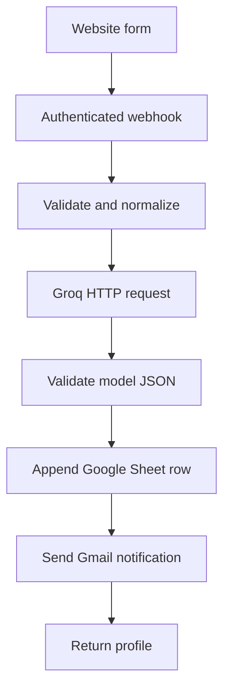

# Part 2 — n8n Lead-Profiling Workflow

The required flow is implemented in
`workflows/lead-profiler.json`. A separate
`workflows/lead-profiler-error-handler.json` sends sanitized failure alerts.

## Main workflow



## Import and configure

1. Create a Google Sheet and import
   `workflows/google-sheet-template.csv` into a tab named `Leads`.
2. In n8n, choose **Import from File** and import both workflow JSON files.
3. Create a **Header Auth** credential for the webhook:
   - Name: `X-Webhook-Secret`
   - Value: generate a long random value
4. Create a second **Header Auth** credential for Groq:
   - Name: `Authorization`
   - Value: `Bearer YOUR_GROQ_API_KEY`
5. Connect your Google Sheets and Gmail accounts with the minimum permissions
   needed for the chosen sheet and sending account.
6. Open the imported nodes and replace:
   - `REPLACE_WITH_GOOGLE_SHEET_ID`
   - `REPLACE_WITH_SALES_TEAM_EMAIL`
   - `REPLACE_WITH_OPERATIONS_EMAIL`
   - each placeholder credential with the matching credential from steps 3–5
7. In the main workflow settings, select
   **Eubrics - Lead Profiler Error Handler** as the error workflow.
8. Test with the Webhook node’s test URL. Inspect every node’s input/output.
9. Publish both workflows and copy the main production webhook URL into:

   ```dotenv
   N8N_LEAD_WEBHOOK_URL=https://YOUR-N8N/webhook/eubrics-lead-profiler
   N8N_WEBHOOK_SECRET=THE_VALUE_FROM_STEP_3
   ```

10. Restart/redeploy the Next.js app and submit both sample leads from
    `/lead-profiler`.

Do not put the Groq key into an HTTP header field directly. The exported JSON
references an n8n credential and contains no secret value.

## Understand every node

| Node | What it does | What to rebuild manually |
|---|---|---|
| Lead Form Webhook | Accepts authenticated POST requests and waits for the response node | Method, path, Header Auth, response mode |
| Validate & Normalize | Checks required fields, email, and page-history bounds; trims values | `$input.first()`, arrays, `throw new Error` |
| Groq Lead Classifier | Calls the OpenAI-compatible Groq endpoint with strict instructions | URL, Header Auth, JSON body, retry settings |
| Validate Model Output | Parses JSON and enforces exactly two supported categories | `JSON.parse`, allowlist, reason bounds |
| Append Lead to Google Sheets | Maps every reviewed value to one row | Spreadsheet, tab, append operation, column mapping |
| Notify Sales Team | Sends the profile and visitor context to sales | Recipient, subject expression, prior-node references |
| Return Profile | Completes the original HTTP request | JSON response and 200 status |
| Error workflow | Sanitizes failure metadata and alerts operations | Error Trigger, safe fields, Gmail |

## Sample production request

```json
{
  "leadId": "3f46e36d-cb55-4cbb-a20e-37a247e6ec85",
  "submittedAt": "2026-07-23T12:00:00.000Z",
  "source": "closeloop-web-form",
  "name": "Alex Kim",
  "email": "alex@example.com",
  "company": "Northstar Labs",
  "jobTitle": "Sales Enablement Director",
  "query": "Can reps practice discovery calls with an AI sales bot?",
  "pageHistory": [
    "/ai-sales-roleplays",
    "/sales-coaching"
  ]
}
```

Expected response:

```json
{
  "success": true,
  "leadId": "3f46e36d-cb55-4cbb-a20e-37a247e6ec85",
  "category": "Sales Bots",
  "reason": "The visitor is evaluating AI sales practice and enablement.",
  "message": "Lead saved and sales team notified."
}
```

## Test matrix

| Test | Expected result |
|---|---|
| Sales roleplay pages + sales query | `Sales Bots`, Sheet row, email, 200 |
| Leadership pages + manager query | `Organizational Development`, Sheet row, email, 200 |
| Mixed history + clear query | Query and full context drive one allowed category |
| Missing email | Validation node fails; no Sheet row or email |
| Malformed model JSON | Output validation fails; no side effects |
| Unsupported category | Output validation fails |
| Groq 429/5xx | Bounded retry, then error workflow |
| Sheets/Gmail transient error | Bounded retry, then error workflow |
| Wrong webhook secret | Request rejected before workflow execution |

## Interview rebuild drill

Practice deleting and rebuilding these in this order:

1. Webhook
2. HTTP Request
3. One Code node
4. Google Sheets
5. Gmail
6. Respond to Webhook

For each one, say aloud: **input → configuration → output → failure mode**.
That is the simplest way to prove you understand the workflow rather than only
having imported it.

## Production limitations

- n8n test and production webhook URLs are different; the production URL needs
  a published workflow.
- The Cloud trial endpoint stops when the trial/workspace ends. Keep the export
  and migrate it to another n8n instance if needed.
- A provider can complete an irreversible action and lose the response. At
  meaningful volume, check `leadId` against durable storage before appending or
  sending and enforce uniqueness.
- Google Sheets is appropriate for the assignment, not a high-volume CRM.
- Add data-retention rules and avoid sending unnecessary personal data to the
  classifier. The current Groq request intentionally excludes the visitor’s
  email address.
