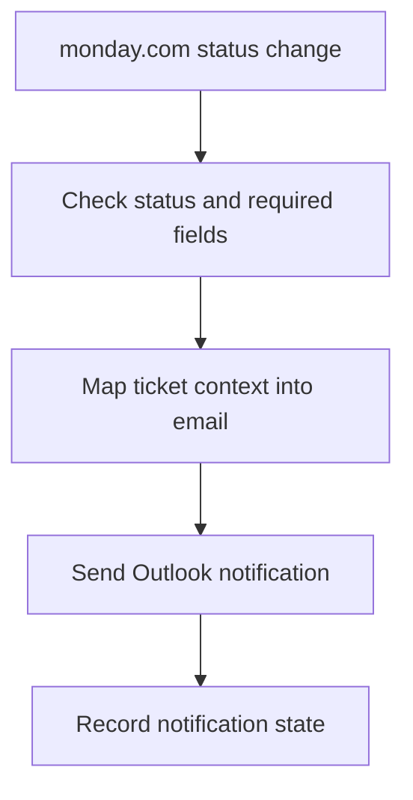

# Part 3 — Existing Automation Case Study

## monday.com + Outlook operations notifications

This is a sanitized description of a real work automation. It excludes employer
records, internal addresses, customer data, board identifiers, and credentials.

### Problem

Operational ticket/status changes needed timely email follow-up. Manually
checking boards, copying context, and writing repeated Outlook messages added
delay and made notifications inconsistent.

### Automation model

### Trigger, actions, conditions, output

- **Trigger:** a relevant monday.com item changes to a configured status.
- **Conditions:** the item belongs to the right workflow, contains the required
  recipient/context fields, and has not already produced that notification.
- **Actions:** read mapped item fields, construct a consistent message, send it
  through Outlook, and record the notification state.
- **Output:** the appropriate stakeholder receives a consistent message without
  somebody monitoring the board manually.

### Reliability choices

- Keep credentials in the automation platform’s managed connections.
- Validate required recipient and ticket fields before sending.
- Make status-to-template mappings explicit and easy to change.
- Record a notification marker to reduce duplicate sends.
- Preserve enough error context to retry safely without exposing private data.
- Keep irreversible email delivery after validation and duplicate checks.

### What to show in the demo

Use a fully synthetic board/item:

1. Show the starting status and dummy recipient.
2. Change the trigger status.
3. Show the automation execution and mapped fields.
4. Show the resulting test email.
5. Explain one invalid-input and one duplicate-event case.

Do not screen-record a live employer board or inbox. If a sanitized recreation
is not available, present the architecture and use the repository’s n8n flow as
the working automation demonstration.
